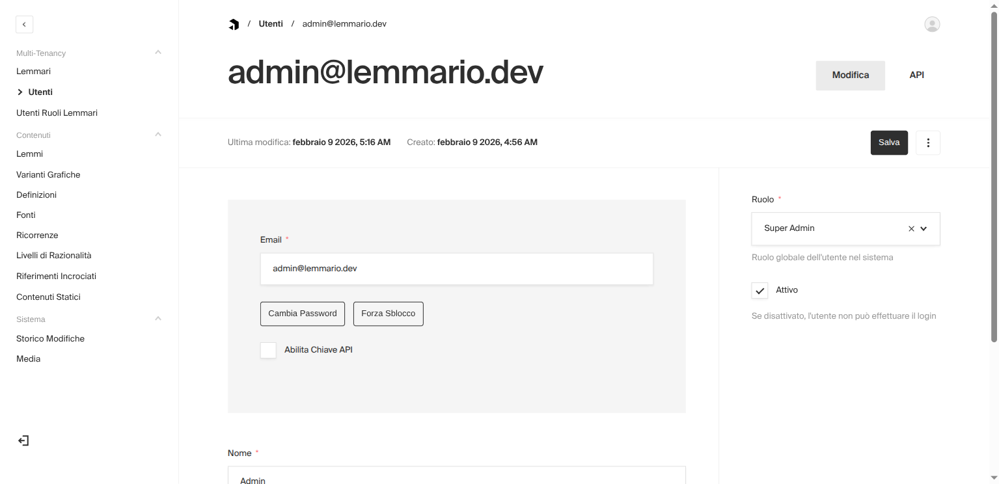
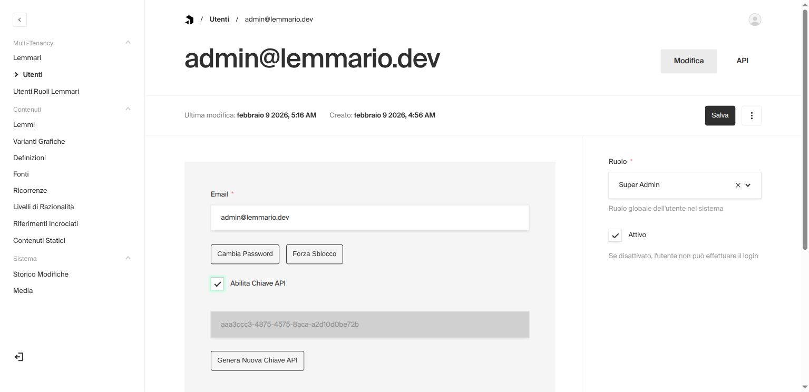

# GraphQL API e Autenticazione API Key

## Panoramica

Il Lemmario espone un'API GraphQL completa oltre all'API REST, entrambe autenticabili tramite API key. Le API key permettono a consumatori esterni (applicazioni web, script, servizi) di accedere ai dati del lemmario senza necessita' di login interattivo.

## Endpoint

| Ambiente | URL |
| --- | --- |
| Sviluppo | `http://localhost:3000/api/graphql` |
| Produzione | `https://glossari.dh.unica.it/api/graphql` |

Il GraphQL Playground e' disponibile in sviluppo navigando all'endpoint GraphQL nel browser. In produzione il playground e' disabilitato.

## Autenticazione

### Formato header

```
Authorization: utenti API-Key <LA_TUA_API_KEY>
```

### Come ottenere una API key

1. Richiedere al **super_admin** l'abilitazione della API key sul proprio account utente
2. Il super_admin apre il profilo utente dall'admin panel (`/admin/collections/utenti/<id>`)
3. Nella sidebar, spunta la checkbox **"Enable API Key"**
4. Payload genera automaticamente una chiave unica (UUID v4)
5. Salvare il profilo utente
6. Copiare la chiave dal campo "API Key" e usarla nell'header `Authorization`

#### Screenshot: API Key disabilitata



*Profilo utente con API Key non abilitata. La checkbox "Enable API Key" e' visibile nella sidebar solo per il super_admin.*

#### Screenshot: API Key abilitata



*Dopo aver spuntato "Enable API Key" e salvato, Payload genera la chiave. Il campo "API Key" mostra il valore da copiare.*

### Permessi

La API key eredita i permessi dell'utente associato:

- **Ruolo**: lettore, redattore, lemmario_admin, super_admin
- **Lemmari assegnati**: l'utente accede solo ai lemmari assegnati via UtentiRuoliLemmari
- I dati pubblici (`pubblicato: true`) sono accessibili anche senza autenticazione

### Revoca

Il super_admin puo' revocare l'accesso:

- Disabilitando il checkbox "Enable API Key" sull'utente
- Impostando `attivo: false` sull'utente (blocca anche login JWT)

## Esempi di Query GraphQL

**Nota sui nomi GraphQL:** Payload CMS genera nomi GraphQL automaticamente dallo slug della collection. Per le query lista usare il nome al plurale generato (es. `Lemmis`, `Fontis`). Per le query per singolo ID usare il nome al singolare (es. `Lemmi`, `Fonti`).

### Elenco lemmi

```graphql
query {
  Lemmis(where: { pubblicato: { equals: true } }) {
    docs {
      id
      termine
      tipo
      slug
    }
    totalDocs
  }
}
```

### Lemma per slug

```graphql
query LemmaDettaglio($slug: String!) {
  Lemmis(where: { slug: { equals: $slug } }) {
    docs {
      id
      termine
      tipo
      slug
      note_redazionali
    }
  }
}
```

### Fonti bibliografiche

```graphql
query {
  Fontis {
    docs {
      id
      shorthand_id
      titolo
      autore
      anno
      riferimento_completo
    }
    totalDocs
  }
}
```

### Definizioni di un lemma

```graphql
query DefinizioniLemma($lemmaId: JSON!) {
  Definizioni(where: { lemma: { equals: $lemmaId } }) {
    docs {
      id
      testo
      ordine
      livello_razionalita {
        codice
        nome
      }
    }
    totalDocs
  }
}
```

### Esempio con curl

```bash
# Query autenticata
curl -g -X POST https://glossari.dh.unica.it/api/graphql \
  -H "Content-Type: application/json" \
  -H "Authorization: utenti API-Key <LA_TUA_API_KEY>" \
  -d '{"query": "{ Lemmis(where: { pubblicato: { equals: true } }) { docs { id termine tipo slug } totalDocs } }"}'

# Query pubblica (solo dati pubblicati, nessuna autenticazione)
curl -g -X POST https://glossari.dh.unica.it/api/graphql \
  -H "Content-Type: application/json" \
  -d '{"query": "{ Lemmis(where: { pubblicato: { equals: true } }) { docs { id termine } } }"}'
```

### Esempio con JavaScript (fetch)

```javascript
const GRAPHQL_URL = 'https://glossari.dh.unica.it/api/graphql'
const API_KEY = 'la-tua-api-key'

const query = `
  query LemmiPubblicati($lemmarioId: JSON!) {
    Lemmis(where: {
      pubblicato: { equals: true }
      lemmario: { equals: $lemmarioId }
    }) {
      docs { id termine tipo slug }
      totalDocs
    }
  }
`

const response = await fetch(GRAPHQL_URL, {
  method: 'POST',
  headers: {
    'Content-Type': 'application/json',
    'Authorization': `utenti API-Key ${API_KEY}`,
  },
  body: JSON.stringify({
    query,
    variables: { lemmarioId: 2 },
  }),
})

const { data } = await response.json()
console.log(data.Lemmis.docs)
```

## Limiti e Sicurezza

| Parametro | Valore | Descrizione |
| --- | --- | --- |
| Rate limit | 500 req/min | Per IP. Configurabile via `RATE_LIMIT_MAX` |
| maxComplexity | 1000 | Complessita' massima di una singola query GraphQL |
| maxDepth | 5 | Profondita' massima delle relazioni nelle query |
| Playground | Disabilitato in prod | Attivo solo in sviluppo (`NODE_ENV=development`) |

### Complessita' query

Ogni campo nella query ha un costo di complessita' (default: 1 per campo scalare, 10 per relazioni). Se una query supera il limite di 1000, viene rifiutata con un errore. Per query che richiedono molti dati annidati, suddividerle in richieste separate.

### Profondita'

La catena di relazioni piu' profonda nel modello dati e': `Lemma -> Definizione -> Ricorrenza -> Fonte` (profondita' 3-4). Il limite di 5 consente tutte le query ragionevoli bloccando query circolari o abusive.

## CORS per Applicazioni Browser

Le applicazioni frontend esterne che accedono all'API GraphQL dal browser devono avere la propria origine abilitata nel CORS. Contattare l'amministratore per aggiungere l'origine alla variabile d'ambiente `CORS_ALLOWED_ORIGINS`.

```bash
# Nel .env del server (origini separate da virgola)
CORS_ALLOWED_ORIGINS=https://app-esterna.example.com,https://altra-app.example.com
```

Le richieste server-to-server (Node.js, Python, script) non sono soggette a restrizioni CORS.

## Collections Disponibili

Le seguenti collections sono accessibili via GraphQL (nomi GraphQL tra parentesi):

| Collection | Query lista | Query singola | Accesso pubblico |
| --- | --- | --- | --- |
| Lemmi | `Lemmis` | `Lemmi(id)` | Si (pubblicato=true) |
| Definizioni | `Definizioni` | `Definizione(id)` | Si |
| Ricorrenze | `Ricorrenze` | `Ricorrenza(id)` | Si |
| Fonti | `Fontis` | `Fonti(id)` | Si |
| VariantiGrafiche | `VariantiGrafiche` | `VarianteGrafica(id)` | Si |
| RiferimentiIncrociati | `RiferimentiIncrociatis` | `RiferimentiIncrociati(id)` | Si |
| LivelliRazionalita | `LivelliRazionalitas` | `LivelliRazionalita(id)` | Si |
| Lemmari | `Lemmaris` | `Lemmari(id)` | Si |
| ContenutiStatici | `ContenutiStaticis` | `ContenutiStatici(id)` | Si (pubblicato=true) |
| Utenti | `Utentis` | `Utenti(id)` | No (auth richiesta) |
| UtentiRuoliLemmari | `UtentiRuoliLemmaris` | `UtentiRuoliLemmari(id)` | No (auth richiesta) |
| StoricoModifiche | `StoricoModifiches` | `StoricoModifiche(id)` | No (auth richiesta) |

## Creazione Service Account

Per consumatori API automatizzati, creare un utente servizio dedicato:

```bash
cd packages/payload-cms
API_USER_EMAIL=api-service@lemmario.internal \
ADMIN_PASSWORD=password-sicura \
pnpm create-api-user
```

Lo script stampa la API key generata. Assegnare poi i lemmari necessari tramite l'admin UI (UtentiRuoliLemmari).

## Testing

I test E2E per l'API GraphQL sono in `packages/frontend/e2e/graphql-api.spec.ts`. Usano il `request` context di Playwright (chiamate HTTP dirette, senza browser) per simulare un consumatore esterno.

### Cosa verificano

| Scenario | Comportamento atteso |
| --- | --- |
| Query pubblica senza auth | Ritorna dati (lemmi, fonti) |
| Query privata senza auth | Errore 403 Forbidden |
| API key invalida su dati pubblici | Fallback a non autenticato, dati pubblici accessibili |
| API key invalida su dati privati | Errore 403 Forbidden |
| API key valida su dati pubblici | Dati accessibili |
| API key valida su dati privati | Dati accessibili (es. collection Utenti) |
| GraphQL con variabili | Query parametrizzata funziona |
| REST API con API key | `/api/lemmi` e `/api/utenti/me` funzionano |

### Prerequisiti

- **Payload CMS in esecuzione** con dati (almeno un lemma pubblicato e una fonte)
- **Utente admin** con email `admin@lemmario.dev` e password `password` (o configurare le variabili d'ambiente `E2E_ADMIN_EMAIL` e `E2E_ADMIN_PASSWORD`)
- Il frontend **non e' necessario** (i test usano solo chiamate HTTP verso Payload)

```bash
# Avvia solo Payload + PostgreSQL
gl up payload
# oppure
docker compose up postgres payload -d
```

### Eseguire i test

```bash
cd packages/frontend

# Esegui solo i test GraphQL API
pnpm test:e2e -- graphql-api

# Con npx (piu' controllo sui parametri)
npx playwright test e2e/graphql-api.spec.ts --project=chromium

# Report HTML interattivo dopo l'esecuzione
npx playwright show-report
```

### Variabili d'ambiente

| Variabile | Default | Descrizione |
| --- | --- | --- |
| `E2E_API_URL` | `http://localhost:3000` | URL base di Payload CMS |
| `E2E_ADMIN_EMAIL` | `admin@lemmario.dev` | Email utente admin per setup |
| `E2E_ADMIN_PASSWORD` | `password` | Password utente admin |

Per testare contro un'istanza remota:

```bash
E2E_API_URL=https://glossari.dh.unica.it \
E2E_ADMIN_EMAIL=admin@lemmario.dev \
E2E_ADMIN_PASSWORD=la-password \
npx playwright test e2e/graphql-api.spec.ts --project=chromium
```
