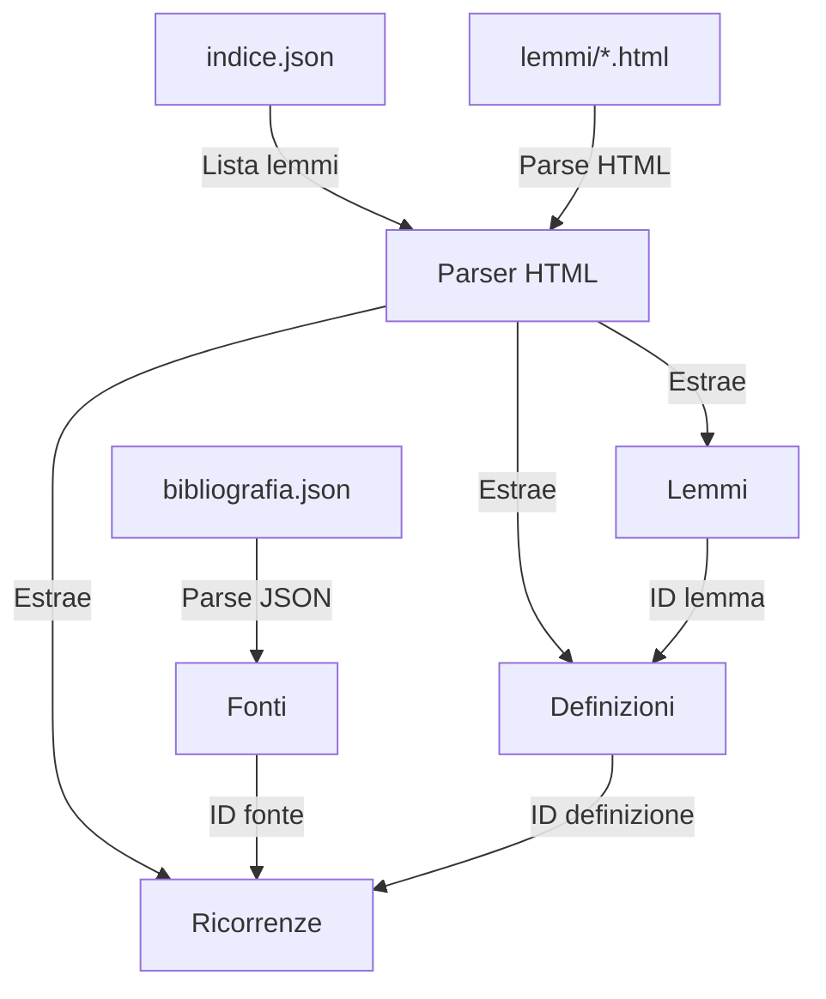

# Guida alla Migrazione Dati Legacy

Questo documento descrive il processo di importazione dei dati dal vecchio sito statico al nuovo sistema Lemmario basato su Payload CMS.

## Panoramica

La migrazione importa:
- **83 fonti bibliografiche** da `old_website/bibliografia.json` (incluse 3 aggiunte manualmente)
- **234 lemmi** (voci del dizionario) da `old_website/lemmi/*.html`
- **~460+ definizioni** per ciascun lemma (con gestione multilinea)
- **~600+ ricorrenze** (citazioni) per ciascuna definizione con riferimenti strutturati alle fonti

## Architettura della Migrazione

```
old_website/
├── bibliografia.json          → Collection: Fonti
├── indice.json               → Indice dei lemmi da importare
└── lemmi/
    ├── additio.html          → Lemma (latino)
    ├── camera.html           → Lemma (volgare)
    ├── camera_lat.html       → Lemma (latino) - DUPLICATO
    └── ...
```

### Flusso di Importazione



## Script di Migrazione

### Posizione
```
scripts/
├── migration/
│   ├── import.ts              # Script principale
│   ├── parsers/
│   │   ├── htmlParser.ts      # Parser per file HTML lemmi
│   │   └── jsonParser.ts      # Parser per JSON bibliografia
│   ├── types.ts               # Interfacce TypeScript
│   └── test-single-lemma.ts   # Test parser singolo lemma
├── package.json
└── tsconfig.json
```

### Esecuzione

#### 1. Prerequisiti
```bash
# Assicurati che il server Payload sia avviato
docker compose up -d payload

# Attendi che l'API sia disponibile
curl http://localhost:3000/api/lemmari
```

#### 2. Esegui Migrazione
```bash
cd scripts
API_URL=http://localhost:3000/api LEMMARIO_ID=2 pnpm migrate
```

Parametri:
- `API_URL`: URL dell'API Payload (default: `http://localhost:3000/api`)
- `LEMMARIO_ID`: ID del lemmario di destinazione (default: `2`)

#### 3. Test di un Singolo Lemma
```bash
cd scripts
pnpm test:lemma
```

## Parser HTML

### Struttura HTML dei Lemmi

I file HTML legacy hanno questa struttura:

```html
<div id="lemma">
    <p class="titolo-lemma">Additio</p>

    <p><strong>1.</strong> s.f. Aggiunta. In relazione alla compravendita...</p>

    <p><strong>Ricorrenza:</strong></p>
    <ul>
        <li>
            <a href="#" class="bibliografia-link" data-biblio="Cap.Conserv.G83">
                Capitula conservatorum di Genova (1383-1386)</a>:
            <p>«...Volenti autem emere libras...» - colonna 413</p>
        </li>
    </ul>

    <p><strong>Livello di razionalità:</strong> 2. Operazioni</p>

    <hr>

    <p><strong>2.</strong> s.f. Aggiunta. In relazione alla compilazione...</p>
    <!-- Definizione 2 con le sue ricorrenze -->
</div>
```

### Estrazione Dati

Il parser (`parsers/htmlParser.ts`) estrae:

1. **Definizioni**: Separate da tag `<hr>`, identificate da `<strong>N.</strong>`
   - Regex multilinea con `[\s\S]+?` per gestire testi su più righe
2. **Testo definizione**: Rimosso HTML, convertito in plain text
   - Pre-processing HTML malformato (tag incompleti come `p>` senza `<`)
3. **Livello di razionalità**: Estratto da regex `/Livello di razionalità:<\/strong>\s*(\d+)/`
4. **Ricorrenze**: Da elementi `<li>` con iterazione su ogni `<p>` individuale:
   - `shorthand_id`: Attributo `data-biblio` del link
   - `citazione_originale`: Testo tra virgolette `«...»`
   - `pagina_raw`: Testo completo del riferimento
   - Riferimenti strutturati con pattern ampliati:
     - `c. Nr/v` + `rubr. N "Titolo"` (carta + rubrica)
     - `col. N` / `colonna N` (colonna, anche senza spazi)
     - `p. N` + `Libro X, cap. N` (pagina + libro + capitolo)

### Gestione Lemmi Bilingue

Alcuni lemmi esistono in entrambe le lingue:
- `camera.html` (volgare)
- `camera_lat.html` (latino)

**Soluzione**: Lo slug include il suffisso `-lat` per lemmi latini:
- Volgare: `camera` → slug: `camera`
- Latino: `camera` → slug: `camera-lat`

## Gestione Errori

### Rate Limiting (429)

**Problema**: Troppe richieste simultanee all'API Payload.

**Soluzione**: Aggiunto delay di 100ms tra ogni lemma:
```typescript
// Aggiungi delay per evitare rate limiting
await new Promise(resolve => setTimeout(resolve, 100))
```

### Definizioni Vuote (400 - "testo is required")

**Problema**: Il parser non rimuoveva HTML tags dal testo.

**Soluzione**: Utilizzo di Cheerio per rimuovere tags:
```typescript
const $temp = cheerio.load(`<div>${defMatch[2]}</div>`)
const testoDefinizione = $temp.text().trim()
```

### Duplicati Slug (400 - "Value must be unique")

**Problema**: Lemmi bilingue generavano lo stesso slug.

**Soluzione**: Suffisso `-lat` per lemmi latini:
```typescript
const slug = tipo === 'latino' ? `${slugBase}-lat` : slugBase
```

### Definizioni Multilinea

**Problema**: Il parser non gestiva testi di definizione su più righe nell'HTML.

**Soluzione**: Uso di `[\s\S]+?` al posto di `.+?` nelle regex per matchare anche i newline:
```typescript
// Prima (bug):
const defMatch = $section.html()?.match(/<p><strong>(\d+)\.<\/strong>\s*(.+?)<\/p>/)
// Dopo (fix):
const defMatch = $section.html()?.match(/<p><strong>(\d+)\.<\/strong>\s*([\s\S]+?)<\/p>/)
```

### HTML Malformato

**Problema**: Alcuni file HTML hanno tag incompleti (es. `p>` senza `<`).

**Soluzione**: Pre-processing dell'HTML prima del parsing Cheerio per correggere tag malformati.

### Citazioni Multiple per Ricorrenza

**Problema**: Un singolo `<li>` può contenere più `<p>` con citazioni separate. Il parser concatenava tutto in una stringa unica.

**Soluzione**: Iterazione su ogni `<p>` individualmente per estrarre citazioni separate.

## Mapping Campi

### Bibliografia → Fonti

| bibliografia.json | Collection Fonti |
|------------------|------------------|
| `[key]` | `shorthand_id` |
| `title` | `titolo_completo` |
| `reference` | `citazione_completa` |
| `author` | `autore` |
| `date` | `anno_pubblicazione` |
| `publisher` | `editore` |
| `place` | `luogo_pubblicazione` |

### Lemma HTML → Lemmi

| HTML | Collection Lemmi |
|------|------------------|
| `indice.json[].nome` | `termine` |
| `indice.json[].tipo` | `tipo` |
| Generato | `slug` |

### Definizione HTML → Definizioni

| HTML | Collection Definizioni |
|------|------------------------|
| `<strong>N.</strong>` | `numero_definizione` |
| Testo dopo numero | `testo` |
| `Livello di razionalità: N` | `livello_razionalita` |

### Ricorrenza HTML → Ricorrenze

| HTML | Collection Ricorrenze |
|------|----------------------|
| `data-biblio` | `fonte` (relationship) |
| `«...»` | `testo_originale` |
| Full reference text | `pagina_raw` |
| `col. N` / `colonna N` | `tipo_riferimento: colonna`, `numero` |
| `p. N` | `tipo_riferimento: pagina`, `numero` |
| `c. Nr/v` | `tipo_riferimento: carta`, `numero` |
| `rubr. N "Titolo"` | `rubrica_numero`, `rubrica_titolo` |
| `Libro X, cap. N` | `libro`, `capitolo` |

## Controlli e Validazione

### 1. Verifica Fonti Duplicate
```typescript
const existing = await fetchPayload(
  `/fonti?where[shorthand_id][equals]=${shorthandId}&limit=1`
)
```

### 2. Verifica Lemmi Duplicate
```typescript
const existing = await fetchPayload(
  `/lemmi?where[termine][equals]=${encodeURIComponent(parsedLemma.termine)}&where[tipo][equals]=${parsedLemma.tipo}&limit=1`
)
```

### 3. Risoluzione Riferimenti
```typescript
const fonteId = fontiMap.get(ric.shorthand_id)
if (!fonteId) {
  console.warn(`⚠ Fonte non trovata per shorthand: ${ric.shorthand_id}`)
  continue
}
```

## Statistiche di Migrazione

Lo script produce statistiche dettagliate con report Markdown:

```
============================================================
RIEPILOGO MIGRAZIONE
============================================================

Fonti:       83/83 importate (0 errori)
Lemmi:       234/234 importati (0 errori)
Definizioni: ~460+ importate
Ricorrenze:  ~600+ importate

============================================================
```

Le statistiche sono migliorate rispetto alla v1.0 grazie a:
- **Definizioni**: da ~430 a ~460+ (recupero di ~18 sezioni perse per il bug multilinea)
- **Ricorrenze**: da ~555 a ~600+ (estrazione citazioni multiple e fix multilinea)
- **Fonti**: 83 complete (incluse 3 precedentemente mancanti: Stat.Rigattieri, Stat.Correggiai, Memoriale_abacho)

### Log Dettagliati

Durante l'esecuzione vengono mostrati:
- `✓ Fonte importata: Stat.fornai.1339 (ID: 1)`
- `✓ Lemma importato: additio (ID: 5)`
- `⚠ Errore importando definizione N: ...`
- `✗ Errore importando lemma camera: ...`

## Troubleshooting

### Problema: API non risponde

```bash
# Verifica che Payload sia in esecuzione
docker ps | grep payload

# Controlla i log
docker logs lemmario_payload

# Riavvia se necessario
docker compose restart payload
```

### Problema: Errori di validazione

```bash
# Test con un singolo lemma per debug
cd scripts
pnpm test:lemma
```

### Problema: Database pieno di dati parziali

```bash
# Reset del database (ATTENZIONE: cancella tutti i dati!)
docker compose down
docker volume rm lemmario_ts_postgres_data
docker compose up -d
```

## Configurazione Access Control Temporanea

Per permettere la migrazione senza autenticazione, le collections sono state modificate temporaneamente:

**PRIMA della migrazione** (modificato):
```typescript
access: {
  create: public_,  // Temporaneo per migrazione
  read: public_,
  update: authenticated,
  delete: authenticated,
}
```

**DOPO la migrazione** (da ripristinare):
```typescript
access: {
  create: authenticated,  // Ripristinare
  read: public_,
  update: authenticated,
  delete: authenticated,
}
```

Collections interessate:
- `Fonti.ts`
- `Lemmi.ts`
- `Definizioni.ts`
- `VariantiGrafiche.ts`
- `Ricorrenze.ts` (include campi aggiuntivi per riferimenti strutturati: `pagina_raw`, `tipo_riferimento`, `numero`, `rubrica_numero`, `rubrica_titolo`, `libro`, `capitolo`)

## Sviluppi Futuri

### Miglioramenti Pianificati

1. **Resume capability**: Riprendere migrazione da dove si è interrotta
2. **Batch processing**: Processare lemmi in batch per migliori performance
3. **Validation report**: Generare report HTML con errori dettagliati
4. **Dry-run mode**: Simulare migrazione senza scrivere dati
5. **Incremental updates**: Aggiornare solo lemmi modificati

### Possibili Ottimizzazioni

```typescript
// Batch insert per definizioni
const defPromises = parsedLemma.definizioni.map(def =>
  fetchPayload('/definizioni', {
    method: 'POST',
    body: JSON.stringify(defData),
  })
)
await Promise.all(defPromises)
```

## Changelog

### v2.0 (Febbraio 2026)

- **Fix**: Gestione testo multilinea nelle definizioni e citazioni
- **Fix**: Pre-processing HTML malformato (tag `<p>` incompleti)
- **Fix**: Gestione definizioni con testo vuoto (placeholder automatico)
- **Fix**: Citazioni multiple per singola ricorrenza ora estratte separatamente
- **Miglioramento**: Pattern di riferimento ampliati (carta+rubrica, colonna senza spazi, pagina+libro+capitolo)
- **Dati**: Aggiunte 3 fonti mancanti a bibliografia.json (Stat.Rigattieri, Stat.Correggiai, Memoriale_abacho)
- **Report**: Statistiche dettagliate per tipo nel report di migrazione

### v1.0 (Gennaio 2026)

- Prima versione dello script di migrazione
- Import fonti, lemmi, definizioni, ricorrenze
- Report Markdown automatico

## Riferimenti

- Parser HTML: [`scripts/migration/parsers/htmlParser.ts`](../scripts/migration/parsers/htmlParser.ts)
- Parser JSON: [`scripts/migration/parsers/jsonParser.ts`](../scripts/migration/parsers/jsonParser.ts)
- Script principale: [`scripts/migration/import.ts`](../scripts/migration/import.ts)
- Collections Payload: [`packages/payload-cms/src/collections/`](../packages/payload-cms/src/collections/)
- Dati legacy: [`old_website/`](../old_website/)
