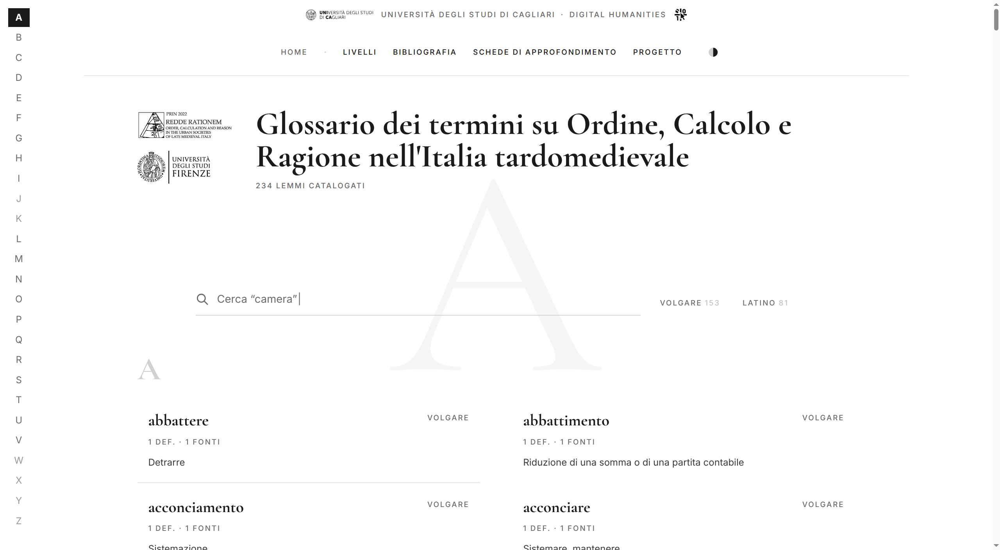

# Portale Glossari — Panoramica del Progetto

## 1. Introduzione e contesto

Il progetto **Glossari** nasce nell'ambito delle attività del Centro Interdipartimentale per l'Umanistica Digitale dell'Università degli Studi di Cagliari.

L'obiettivo è la realizzazione di una piattaforma digitale per la registrazione, la gestione e la consultazione pubblica di glossari in lingua italiana. Il primo glossario ospitato dalla piattaforma . Il primo glossario ospitato è il *Glossario dei termini su Ordine, Calcolo e Ragione nell'Italia tardo-medievale* di terminologia storica italiana — in particolare lessico matematico, economico e giuridico del periodo tardo-medievale (secoli XIII–XVI), sviluppato nell'ambito del progetto PRIN 2022 "Redde Rationem" dell'Università di Cagliari, dell'Università di Firenze, dell'Università di Milano e dell'Università di Siena.

La piattaforma *Glossari* è stata progettata per rappresentare una soluzione dinamica, multi-tenancy e orientata alle API, con lo scopo di ospitare più glossari indipendenti sulla medesima infrastruttura.

**Indirizzo di produzione:** [https://glossari.dh.unica.it](https://glossari.dh.unica.it)

---

## 2. Obiettivi e scenari d'uso

L'applicativo consente di:

- **Registrare e organizzare** uno o più glossari (lemmari), ciascuno con i propri lemmi, definizioni, citazioni da fonti storiche, varianti grafiche e riferimenti incrociati.
- **Consultare pubblicamente** i glossari attraverso un'interfaccia web con ricerca in tempo reale, navigazione alfabetica e filtri per lingua (latino/volgare).
- **Gestire i contenuti** attraverso un pannello di amministrazione con controllo degli accessi basato su ruoli, che consente a più redattori di lavorare sui dati in maniera collaborativa e tracciata.

### Scenari futuri

L'architettura API-first è stata pensata anche per abilitare scenari di utilizzo più avanzati:

- **Plugin di integrazione per siti terzi:** siti internet che trattano temi correlati potranno integrare un plugin che interroga automaticamente le API del glossario e crea collegamenti ipertestuali tra le parole presenti nelle proprie pagine e le corrispondenti voci del lemmario.
- **Frontend multipli:** le stesse API potranno essere consumate da frontend diversi — ad esempio un'interfaccia dedicata a un singolo glossario, ospitata su un dominio differente.
- **Applicazioni mobile:** le API REST e GraphQL consentono lo sviluppo di app native per la consultazione dei glossari.

---

## 3. Architettura del sistema

L'applicativo si compone di tre elementi principali, ciascuno con un ruolo ben definito:

| Componente   | Tecnologia                             | Ruolo                                                                 |
| -------------- | ---------------------------------------- | ----------------------------------------------------------------------- |
| **Backend**  | Payload CMS 2.x (TypeScript) + Express | Gestione dei dati, pannello di amministrazione, esposizione delle API |
| **Database** | PostgreSQL 16                          | Persistenza dei dati                                                  |
| **Frontend** | Next.js 14 (TypeScript)                | Interfaccia pubblica di consultazione                                 |

### Perché questa architettura

La scelta di un CMS *headless* (Payload CMS) consente di separare nettamente la gestione dei dati dalla loro presentazione. Il backend espone i contenuti attraverso **API REST** e **API GraphQL**, permettendo a qualsiasi client — sia il frontend attuale, sia applicazioni future — di consumare i dati in maniera standardizzata.

Questo approccio offre diversi vantaggi:

- **Flessibilità:** è possibile sviluppare frontend diversi senza modificare il backend.
- **Performance:** il frontend può essere ottimizzato indipendentemente, sfruttando il rendering lato server di Next.js.
- **Interoperabilità:** le API GraphQL consentono interrogazioni efficienti e granulari, ideali per client che necessitano di selezionare solo i dati di interesse.
- **Estensibilità:** nuove funzionalità (export dati, integrazioni con sistemi esterni, plugin) possono essere aggiunte come endpoint indipendenti.

Il progetto adotta un'organizzazione **monorepo** gestita con pnpm, che mantiene backend e frontend nello stesso repository facilitando lo sviluppo coordinato.

---

## 4. Modello dei dati

Il sistema è modellato su **13 entità** (collections in Payload CMS, corrispondenti a tabelle PostgreSQL), organizzate in tre gruppi funzionali.

### Entità multi-tenancy

- **Lemmari:** contenitore principale per ciascun glossario. Include titolo, descrizione, logo del glossario, loghi partner, periodo storico coperto e configurazione SEO.
- **Utenti:** gli utilizzatori del sistema, con ruoli globali (super_admin, lemmario_admin, redattore, lettore).
- **UtentiRuoliLemmari:** tabella di associazione che assegna a ciascun utente un ruolo specifico per ogni glossario cui ha accesso.

### Entità lessicografiche (core)

- **Lemmi:** le voci del glossario. Ogni lemma ha un termine, un tipo (latino o volgare), uno slug per gli URL, un flag di pubblicazione e note redazionali.
- **VariantiGrafiche:** le forme ortografiche alternative di un lemma (es. "camara" per "camera").
- **Definizioni:** le definizioni numerate di ciascun lemma, ciascuna classificabile secondo un livello di razionalità.
- **LivelliRazionalità:** tassonomia a 6 livelli per classificare i concetti (es. "Operazioni", "Gestione", "Speculazione").
- **Ricorrenze:** le citazioni testuali dalle fonti storiche, con il testo originale in italiano medievale o latino e i riferimenti bibliografici strutturati (carta, pagina, colonna, rubrica, libro, capitolo).
- **Fonti:** le opere bibliografiche di riferimento, con un identificativo breve preservato dal sito legacy per garantire la continuità degli URL.
- **RiferimentiIncrociati:** i rimandi tra lemmi (CFR, VEDI, VEDI ANCHE), gestiti automaticamente in modo bidirezionale.

### Entità di sistema

- **ContenutiStatici:** pagine informative (chi siamo, metodologia, ecc.) gestite come contenuto rich-text.
- **StoricoModifiche:** registro di audit immutabile che traccia ogni operazione di creazione, modifica e cancellazione su tutte le entità principali.
- **Media:** archivio per le immagini caricate (loghi, foto di copertina).

### Relazioni principali

Ogni **Lemmario** contiene N **Lemmi**; ogni **Lemma** può avere N **VariantiGrafiche**, N **Definizioni** e N **RiferimentiIncrociati** verso altri lemmi. Ogni **Definizione** può avere N **Ricorrenze**, ciascuna collegata a una **Fonte** bibliografica e classificata secondo un **LivelloRazionalità**.

---

## 5. Gestione multi-tenancy e controllo accessi

Il sistema implementa un controllo degli accessi a due livelli:

1. **Ruolo globale** (sull'utente): determina le capacità generali (super_admin può gestire tutto il sistema; lettore ha accesso in sola lettura).
2. **Ruolo per lemmario** (nella tabella di giunzione): determina cosa un utente può fare all'interno di uno specifico glossario (amministrare, redigere o solo leggere).

Tutti i contenuti sono automaticamente filtrati per lemmario di appartenenza: un redattore vede e modifica solo i lemmi dei glossari a cui è stato assegnato. Il pubblico non autenticato può consultare esclusivamente i lemmi pubblicati.

---

## 6. Backend: Payload CMS

Il backend offre:

- **Pannello di amministrazione** con interfaccia personalizzata. In particolare, per i lemmi è disponibile un **form integrato multi-step** che consente di gestire in un'unica schermata il lemma, le sue varianti, le definizioni con le relative citazioni e i riferimenti incrociati — senza dover navigare tra schermate separate.
- **API REST** complete per tutte le 13 collections, con autenticazione JWT e supporto per API key.
- **API GraphQL** per interrogazioni efficienti e flessibili, con rate limiting e controllo della complessità delle query.
- **Audit trail automatico:** ogni modifica ai dati principali viene registrata con snapshot prima/dopo, utente, timestamp e indirizzo IP.
- **Riferimenti incrociati bidirezionali:** quando si crea un rimando dal lemma A al lemma B, il sistema genera automaticamente il rimando inverso da B ad A.
- **Export del database:** gli utenti super_admin possono scaricare un dump SQL completo del database direttamente dal pannello di amministrazione, per backup o per la riproduzione dell'ambiente in locale.

---

## 7. Frontend: interfaccia pubblica

### Struttura e navigazione

L'interfaccia pubblica si articola nelle seguenti sezioni:

- **Homepage:** presenta l'elenco dei glossari disponibili, ciascuno con immagine di copertina, titolo e contatore animato dei lemmi.
- **Indice del glossario:** elenco completo dei lemmi, raggruppati per lettera dell'alfabeto, con barra di ricerca in tempo reale e filtri per lingua (latino/volgare).
- **Dettaglio lemma:** scheda completa del termine con tipo linguistico, varianti grafiche, definizioni numerate con livello di razionalità, citazioni dalle fonti storiche (con testo originale tra caporali) e riferimenti incrociati.
- **Bibliografia:** elenco delle fonti bibliografiche con conteggio delle ricorrenze e lemmi associati, filtrate per escludere le fonti prive di citazioni.
- **Livelli di razionalità:** raggruppamento dei lemmi per livello tassonomico.
- **Ricerca avanzata:** ricerca trasversale a tutti i glossari con filtri per lingua e dizionario.
- **Pagine statiche:** contenuti informativi gestiti dal CMS (progetto, chi siamo, ecc.).

### Design e identità visiva

L'interfaccia è stata progettata con un'estetica **tipografico-accademica** che richiama deliberatamente la pagina di un dizionario classico cartaceo. Le scelte di design principali sono:

- **Tipografia:** il font **Cormorant Garamond** (serif) è utilizzato per i titoli, i termini dei lemmi, le citazioni e tutti gli elementi che richiamano la tradizione tipografica rinascimentale — coerente con il periodo storico trattato. Il font **Inter** (sans-serif) è impiegato per il corpo del testo, i metadati e gli elementi di interfaccia, garantendo leggibilità su schermo.
- **Layout a due colonne:** nella pagina dell'indice, i lemmi sono disposti su **due colonne** affiancate su desktop, evocando la doppia colonna tipica delle pagine di un dizionario stampato. Su dispositivi mobili il layout si adatta a colonna singola.
- **Spaziatura e gerarchia:** ampio uso di spazio bianco, spaziature generose tra le sezioni e una chiara gerarchia tipografica (titoli serif di grande dimensione, etichette in maiuscoletto con spaziatura tra le lettere, testi di corpo con interlinea ampia) creano un'esperienza di lettura rilassata e accademica.
- **Lettera di sfondo:** una grande lettera decorativa semi-trasparente appare sullo sfondo della pagina, cambiando dinamicamente in corrispondenza della sezione alfabetica visualizzata — un richiamo visivo all'organizzazione per lettera tipica dei dizionari.
- **Navigazione alfabetica:** una barra laterale fissa con le 26 lettere dell'alfabeto (su desktop) o un pulsante flottante con griglia di lettere (su mobile) consente la navigazione rapida tra le sezioni.
- **Palette cromatica:** monocromatica (nero, grigio, bianco), con supporto completo per la modalità scura. I termini latini sono resi in corsivo per distinguerli dalle voci in volgare.

### Accessibilità e SEO

L'interfaccia rispetta le linee guida di accessibilità: link di salto al contenuto, landmark ARIA, target touch di almeno 44px, supporto per la navigazione da tastiera e rispetto della preferenza `prefers-reduced-motion` per le animazioni.

L'ottimizzazione per i motori di ricerca include: sitemap XML dinamica, robots.txt con controllo granulare dei crawler AI per singolo glossario, metadati Open Graph e Twitter Card, dati strutturati JSON-LD (DefinedTerm, BreadcrumbList, EducationalOrganization), URL canonici e tag per la citazione accademica.

---

## 8. Infrastruttura e deployment

L'intero applicativo è containerizzato con **Docker** in tre servizi (backend, database, frontend) ed è ospitato su una **macchina virtuale** nel data center dell'Università di Cagliari, messa a disposizione dal Centro Interdipartimentale per l'Umanistica Digitale.

Un **reverse proxy** (esterno alla macchina applicativa) instrada le richieste al dominio `glossari.dh.unica.it` verso il server che ospita l'applicativo.

Il processo di deploy è completamente automatizzato tramite **GitHub Actions**:

1. Ogni push sul branch principale avvia la pipeline CI (lint, typecheck, build).
2. Se la CI passa, le immagini Docker vengono costruite e pubblicate su GitHub Container Registry.
3. Un runner self-hosted sulla macchina di produzione scarica le nuove immagini, effettua un backup del database, riavvia i servizi e verifica la salute dell'applicativo.
4. In caso di errore, un meccanismo di **rollback automatico** ripristina la versione precedente.

Il database e i file media sono preservati durante tutti i deploy, garantendo la continuità dei dati.

---

## 9. Codice sorgente e riproducibilità

Il codice sorgente è rilasciato sotto **licenza open source** ed è ospitato nel repository GitHub del Centro Interdipartimentale per l'Umanistica Digitale dell'Università di Cagliari.

Il repository contiene:

- Il codice completo di backend, frontend e script di migrazione.
- La documentazione tecnica per la configurazione e il deployment.
- Le istruzioni per **riprodurre l'intero applicativo in locale** tramite Docker Compose, con un singolo comando.

Per disporre anche dei dati, gli utenti con permessi di super_admin possono **scaricare un dump del database** direttamente dall'interfaccia di amministrazione di Payload CMS. Questo dump può essere importato nell'istanza locale per ottenere una replica completa dell'ambiente di produzione.

---

## 10. Migrazione dati dal sito legacy

I dati del precedente sito statico del primo glossario contenuto nell'applicativo sono stati importati attraverso script di migrazione in TypeScript che effettuano il parsing dei file HTML e JSON originali e li trasformano nelle entità del nuovo sistema tramite le API REST.

La migrazione ha gestito:

- Il parsing delle definizioni (separate da tag `
` nell'HTML originale).
- L'estrazione delle citazioni storiche con i relativi riferimenti bibliografici strutturati.
- La preservazione degli identificativi brevi delle fonti per la compatibilità con gli URL del sito precedente.
- La distinzione tra lemmi latini e volgari, con suffisso `-lat` negli slug per evitare collisioni.

**Stato attuale dei dati in produzione:** 234 lemmi, 86 fonti bibliografiche, 449 definizioni, 850 ricorrenze, 104 riferimenti incrociati e 6 livelli di razionalità.

---

## 11. Il primo glossario ospitato

Il **Glossario dei termini su Ordine, Calcolo e Ragione nell'Italia tardo-medievale** è il primo glossario pubblicato sulla piattaforma. Sviluppato nell'ambito del progetto PRIN "Redde Rationem", documenta la terminologia matematica, economica e giuridica presente nelle fonti italiane dei secoli XIII–XVI — statuti comunali, trattati mercantili, manuali d'abaco e testi giuridici.

Il glossario comprende lemmi sia in **volgare italiano** (la lingua d'uso nei testi commerciali e amministrativi) sia in **latino** (la lingua dei testi giuridici e dottrinali), con varianti grafiche che documentano le oscillazioni ortografiche tipiche dell'italiano pre-normativo.

Ogni voce è arricchita da definizioni classificate secondo una tassonomia a sei livelli di razionalità, citazioni dirette dalle fonti con il testo originale, e rimandi incrociati che collegano termini semanticamente correlati.

---

## 12. Sviluppi futuri

Tra gli sviluppi previsti e ipotizzati:

- **Plugin di integrazione** per siti terzi, che consenta di creare automaticamente collegamenti ipertestuali tra le parole di una pagina web e le corrispondenti voci del glossario.
- **Frontend dedicati** per singoli glossari, ospitati su domini indipendenti.
- **Applicazioni mobile** per la consultazione dei glossari.
